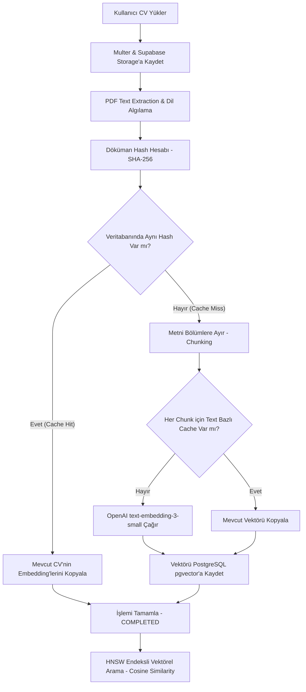

# Astro & Express Monorepo Projesi

Bu proje, frontend tarafında **Astro**, backend tarafında ise **Express.js (TypeScript & Prisma 7 & Supabase)** kullanan entegre bir yapıdır.

---

## 📂 Proje Yapısı

```text
/
├── public/                  # Astro statik dosyaları
├── src/                     # Astro frontend kaynak dosyaları
│   ├── lib/
│   │   └── supabase.ts      # Frontend Supabase istemci bağlantısı
│   └── ...
├── server/                  # Backend klasörü (Express.js)
│   ├── src/
│   │   └── index.ts         # Backend sunucusu giriş noktası ve rotalar
│   ├── prisma/
│   │   └── schema.prisma    # Veritabanı modeli (User, Role vb.)
│   ├── prisma.config.ts     # Prisma 7 konfigürasyon dosyası
│   ├── tsconfig.json        # TypeScript ayarları (NodeNext / ES2022)
│   └── package.json
├── package.json             # Root Astro projesi ayarları
└── .gitignore               # Tüm proje için git kuralları (Hassas bilgiler korunur!)
```

---

## 🚀 Kurulum ve Çalıştırma

### 0. Projeyi Klonlama
```bash
git clone https://github.com/omerabali/STAJ22001.git
cd STAJ22001/astro-project
```

### 1. Veritabanı ve Çevre Değişkenleri
Hem kök dizinde hem de `server/` dizininde ilgili veritabanı ayarlarını `.env` dosyaları üzerinden tanımlamanız gerekmektedir. 

*   **Root (Astro Frontend) `.env`**:
    ```env
    PUBLIC_SUPABASE_URL=https://<your-project-id>.supabase.co
    PUBLIC_SUPABASE_ANON_KEY=<your-anon-key>
    ```
*   **Server (Express Backend) `server/.env`**:
    ```env
    PORT=5000
    DATABASE_URL="postgresql://postgres.<id>:[password]@aws-1-ap-southeast-1.pooler.supabase.com:6543/postgres?pgbouncer=true"
    DIRECT_URL="postgresql://postgres.<id>:[password]@aws-1-ap-southeast-1.pooler.supabase.com:5432/postgres"
    JWT_SECRET=super_secret_jwt_key_here
    ```

---

### 2. Projeyi Tek Komutla Başlatma (Frontend + Backend)
Kök dizinde bağımlılıkları yükleyin, veritabanını hazırlayın ve her iki sunucuyu da aynı anda çalıştırın:

```bash
# Kök dizin ve server bağımlılıklarını yükle
npm install
npm run install --prefix server

# Prisma modellerini veritabanına uygula ve client'ı üret
cd server
npx prisma db push
npx prisma generate
cd ..

# Hem Astro hem Express sunucusunu eşzamanlı çalıştırır
npm run dev:all
```

Astro projeniz **http://localhost:4321**, Express backend sunucunuz ise **http://localhost:5000** üzerinde ayağa kalkacaktır.

---

## 🔌 API Rotaları

*   **GET `/`**: Karşılama mesajını döner.
*   **GET `/api/health`**: Sunucunun aktifliğini ve Supabase veritabanına olan bağlantının doğruluğunu (`prisma.user.count()`) test eder.

---

## 🛡️ Güvenlik ve Git Kuralları
Kök dizindeki `.gitignore` dosyası, yerelde oluşturulan `.env` dosyalarının ve `node_modules` klasörlerinin yanlışlıkla git repolarına yüklenmesini engeller. Sunucu şifrenizi barındıran hassas veriler asla GitHub'a sızmaz.

---

## 🧠 Embedding Pipeline (Vektörel Arama Akışı)

Projemizde özgeçmiş (CV) yükleme, bölümleme (chunking), OpenAI API ile vektörleştirme (embedding) ve semantik arama adımları aşağıdaki mimari akış şemasına göre yürütülmektedir:



### Teknik Detaylar
- **Yapay Zeka Modeli:** OpenAI `text-embedding-3-small` (1536-boyutlu vektörler üretir).
- **Maliyet Takibi:** Yapılan her API çağrısı, token kullanım miktarları ve hesaplanan tahmini maliyet (`tokensIn * $0.00000002` ve `chat` için `gpt-4o-mini` tarifesiyle) ile birlikte `api_calls` tablosuna `SUCCESS` veya `FAILED` durumuyla kaydedilir.
- **Hata ve Retry Politikası:** OpenAI ağ hataları ile 429 (Rate Limit) sınırlandırmalarında katlanarak artan bekleme süreli (Exponential Backoff) 4 denemelik otomatik retry mekanizması uygulanır. 30 saniye aşımında ilgili chunk `FAILED` olarak işaretlenir ancak dökümanın kalan kısımları işlenmeye devam eder.
- **Güvenlik (RLS — Mimari Notu):** Supabase `cv_embeddings` tablosunda RLS policy tanımlanmış olsa da, backend Prisma + `pg.Pool` ile doğrudan PostgreSQL'e bağlandığı ve Supabase native Auth (GoTrue) kullanılmadığı için `auth.uid()` session context'i bu bağlantılarda set edilmemektedir. **Asıl veri izolasyonu Express katmanında sağlanmaktadır** (bkz. aşağıdaki güvenlik denetimi). RLS policy, ileride Supabase native auth'a geçilmesi durumunda hazır olmak amacıyla tutulmaktadır. Bu durum bir yanıltıcı güvenlik hissi yaratmaması için açıkça belgelenmiştir.

---

## 🔐 Uygulama Katmanı Güvenlik Denetimi (Manuel Audit — 2026-07-08)

Projenin tek gerçek güvenlik katmanı Express middleware + Prisma `WHERE userId` filtresidir. Aşağıda `cvs`, `cv_chunks` ve `cv_embeddings` tablolarına erişen tüm route'ların denetim sonuçları listelenmiştir:

| Route | Metot | Tablo | Kullanıcı Filtresi | Sonuç |
|---|---|---|---|---|
| `POST /api/cv/upload` | `cV.create` | cvs | `userId: req.user.id` ile oluşturuluyor | ✅ |
| `GET /api/cv/` | `cV.findMany` | cvs | `WHERE userId = req.user.id` (ADMIN hariç tümünü görür) | ✅ |
| `GET /api/cv/:id` | `cV.findFirst` | cvs + chunks | `WHERE id = :id AND userId = req.user.id` | ✅ |
| `DELETE /api/cv/:id` | `cV.findFirst` → `cV.delete` | cvs | `WHERE id = :id AND userId = req.user.id` ile sahiplik doğrulanıyor | ✅ |
| `GET /api/cv/search` | `searchSimilarChunks` | cv_embeddings | `JOIN cvs WHERE userId = req.user.id` (userId parametresiyle) | ✅ |
| `POST /api/cv/:id/retry` | `cV.findUnique` | cvs | Sadece `ADMIN` rolü erişebilir (`role !== "ADMIN"` → 403) | ✅ |
| `GET /api/admin/*` | çeşitli | cvs | Sadece `ADMIN` rolü erişebilir (adminMiddleware) | ✅ |

> **Not:** `GET /api/cv/search` endpoint'inde `searchSimilarChunks` fonksiyonu, `userId` parametresi ile çağrılmaktadır. Bu parametre, ham SQL sorgusunda `JOIN cvs WHERE cvs."userId" = $userId` filtresi olarak uygulanarak başka kullanıcılara ait embedding'lerin arama sonuçlarına dahil edilmesi engellenmektedir. Bu güvenlik açığı 2026-07-08 tarihinde tespit edilip düzeltilmiştir.
